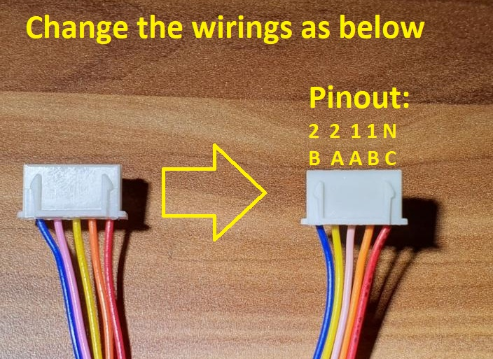

# Filabot

# Printed parts:

 Print parts with -0.15mm horizontal compensation (Simplify3D)

# Electronics and Ramps board setting:

Electronics: Ramps 1.4 with Arduino mega

Motors: 4x 28BYJ-48–5V (modified for bipolar drive)

Steppper drivers: 4x RED A4988 module at 0.2V Vref

Display: Creality stock display

 X  - X1 motor
 
 Y  - X2 motor
 
 E0 - Y1 motor
 
 E1 - Y2 motor

 3x SG90 Servo
 
 For firmware use uploaded modified marlin fw.
